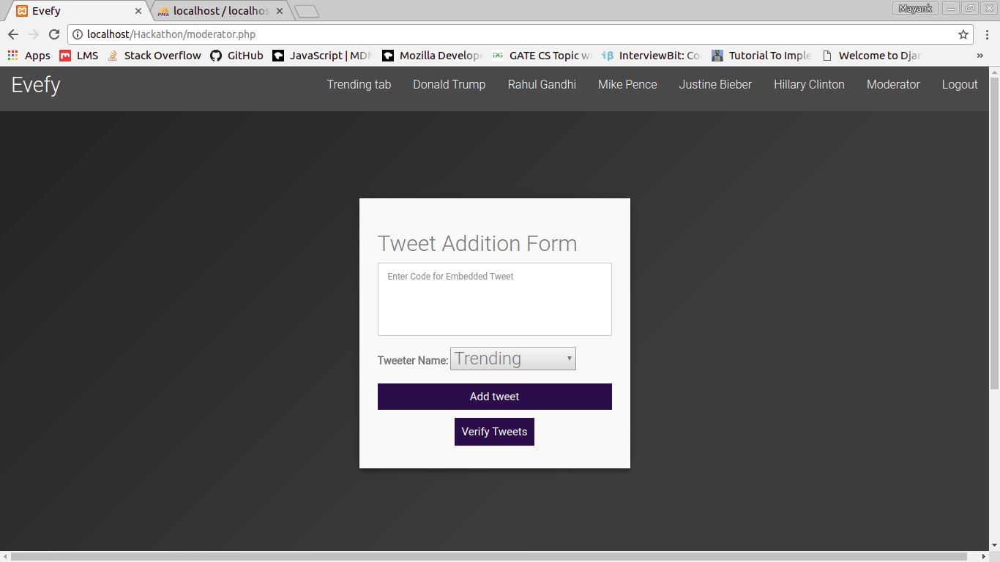

# Hackathon'18 By Skillenza
## IET Hackathon 2018 provided one of the finest platform to showcase our   diverse skillsets under **O(24 Hrs)**. ##
    
    
    if (dedication==true)
    {
        probabiltyOfWinning = 1.0;
    }
    else
    {
        probabiltyOfWinning = 0;
    }
    

### Problem : Fake News ###

---------------------------------
Often sensational and factually incorrect news is created and spread through social media to sway opinions and create a sense of mistrust in the masses. On the other hand, it may also involve narration of a true fact however being deliberately exaggerated .In the present age of technology it is impposible for conventional media to verify every tweet or post made on the internet. The problem is to identify the authenticity of the news and online content. Equally important problem is to identify the bots involved in spreading false news.

-----------------------------------

## Solution </> ##

---------------------------

> We believe that there is no replacement to honest and true journalism in the world, we feel that a comprehensive solution to the problem of fake news can only be addressed with active involvement of journalists. The problem is that the current means of addressing this problem are inefficient for the morden internet age. Our approach to tackle this problem is to make a network of media houses that are actively invloved in vetting the social media posts that are the buzzwords of the day. Our solution allows the media houses to embbed the controversial social media posts and rate the post on the basis of its factual correctness by doing their own research on the topic and also provide relevant articles to prove its correctness. As more and more media houses rate a particular social media post it will either be shown as 'fasle' or 'true' based on the votes and refrences provided by the vetting network. Hence actively crubbing the spread of false news. 

----------------------

## Features ##

- [x] Database Enabled.
- [x] E-mail verification.
- [x] Bot Protection using captcha.
- [x] Register / Login Support
- [x] Dynamic Database

## Deployement ##

>Media houses are allowed to register and then verified by email and through our own teams to ensure that honest and well reknowned media houses are part of our vetting system.

>Each media has an accout throught which they can add a tweet or social media post of a political or reknowned personality after it has fact checked the contents of that social media post throught its own sources. It can also add a detailed article on our site by embedding a weblink of the said article.

>As more media houses join in, the vetting network becomes strong and allows social media posts to be flaged as false or true at a greater pace along with relevent articles related to the buzzing social media posts of that day and more.

-------------------------------
## Expansions in the future ##

- [ ] Social media API (facebook,google plus,yahoo news).
- [ ] Cross platform support (through Electron).
- [ ] Enhanched news localization by allowing strong local networks to exist.
- [ ] Bot integration (using api like rest).

--------------------------------
## Technologies Used ##

* PHP
* SQL
* Bootstrap
* jQuery

---------------------------------------------
## License ##

MIT @Team22

------------------------------------------------------------
